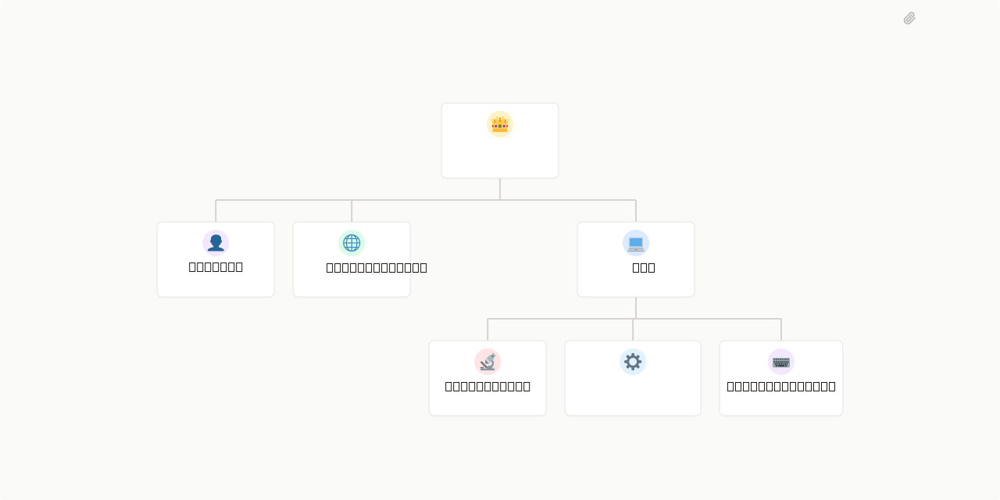

<!--
GENERATED SNAPSHOT — do not edit by hand and do not treat as live source of truth.
The live source of truth for FFmemes Paperclip agents is:
  - agents/.paperclip.yaml          (skills source/ref, adapter config, env contract)
  - agents/<slug>/AGENTS.md         (per-agent prompt + frontmatter `skills:` list)
  - agents/<slug>/routines/*.yaml   (routine descriptions)
The skill table below is informational and may lag the live Paperclip catalog.
Run `agents/deploy.sh --dry-run` to see the current upstream ref + catalog state.
-->

# FFmemes

## What's Inside

> This is an [Agent Company](https://agentcompanies.io) package from [Paperclip](https://paperclip.ing)

| Content | Count |
|---------|-------|
| Agents | 7 |
| Skills | 51 |

### Agents

| Agent | Role | Reports To |
|-------|------|------------|
| Analyst | researcher | ceo |
| CEO | CEO | — |
| Comms Manager | CMO | ceo |
| CTO | CTO | ceo |
| QA Engineer | qa | cto |
| Release Engineer | devops | cto |
| Staff Engineer | Engineer | cto |

### Skills

| Skill | Description | Source |
|-------|-------------|--------|
| autoplan | | | [github](https://github.com/garrytan/gstack) |
| benchmark-models | | | [github](https://github.com/garrytan/gstack) |
| benchmark | | | [github](https://github.com/garrytan/gstack) |
| browse | | | [github](https://github.com/garrytan/gstack) |
| canary | | | [github](https://github.com/garrytan/gstack) |
| careful | | | [github](https://github.com/garrytan/gstack) |
| checkpoint | | | [github](https://github.com/garrytan/gstack) |
| codex | | | [github](https://github.com/garrytan/gstack) |
| connect-chrome | | | [github](https://github.com/garrytan/gstack) |
| context-restore | | | [github](https://github.com/garrytan/gstack) |
| context-save | | | [github](https://github.com/garrytan/gstack) |
| cso | | | [github](https://github.com/garrytan/gstack) |
| design-consultation | | | [github](https://github.com/garrytan/gstack) |
| design-html | | | [github](https://github.com/garrytan/gstack) |
| design-review | | | [github](https://github.com/garrytan/gstack) |
| design-shotgun | | | [github](https://github.com/garrytan/gstack) |
| devex-review | | | [github](https://github.com/garrytan/gstack) |
| document-release | | | [github](https://github.com/garrytan/gstack) |
| freeze | | | [github](https://github.com/garrytan/gstack) |
| gstack-openclaw-ceo-review | Use when asked to review a plan, challenge a proposal, run a CEO review, poke holes in an approach, think bigger about scope, or decide whether to expand or reduce the plan. | [github](https://github.com/garrytan/gstack) |
| gstack-openclaw-investigate | Use when asked to debug, fix a bug, investigate an error, or do root cause analysis, and when users report errors, stack traces, unexpected behavior, or say something stopped working. | [github](https://github.com/garrytan/gstack) |
| gstack-openclaw-office-hours | Use when asked to brainstorm, evaluate whether an idea is worth building, run office hours, or think through a new product idea or design direction before any code is written. | [github](https://github.com/garrytan/gstack) |
| gstack-openclaw-retro | Weekly engineering retrospective. Analyzes commit history, work patterns, and code quality metrics with persistent history and trend tracking. Team-aware with per-person contributions, praise, and growth areas. Use when asked for weekly retro, what shipped this week, or engineering retrospective. | [github](https://github.com/garrytan/gstack) |
| gstack-upgrade | | | [github](https://github.com/garrytan/gstack) |
| gstack | | | [github](https://github.com/garrytan/gstack) |
| guard | | | [github](https://github.com/garrytan/gstack) |
| health | | | [github](https://github.com/garrytan/gstack) |
| investigate | | | [github](https://github.com/garrytan/gstack) |
| land-and-deploy | | | [github](https://github.com/garrytan/gstack) |
| learn | | | [github](https://github.com/garrytan/gstack) |
| make-pdf | | | [github](https://github.com/garrytan/gstack) |
| office-hours | | | [github](https://github.com/garrytan/gstack) |
| open-gstack-browser | | | [github](https://github.com/garrytan/gstack) |
| pair-agent | | | [github](https://github.com/garrytan/gstack) |
| plan-ceo-review | | | [github](https://github.com/garrytan/gstack) |
| plan-design-review | | | [github](https://github.com/garrytan/gstack) |
| plan-devex-review | | | [github](https://github.com/garrytan/gstack) |
| plan-eng-review | | | [github](https://github.com/garrytan/gstack) |
| plan-tune | | | [github](https://github.com/garrytan/gstack) |
| qa-only | | | [github](https://github.com/garrytan/gstack) |
| qa | | | [github](https://github.com/garrytan/gstack) |
| retro | | | [github](https://github.com/garrytan/gstack) |
| review | | | [github](https://github.com/garrytan/gstack) |
| setup-browser-cookies | | | [github](https://github.com/garrytan/gstack) |
| setup-deploy | | | [github](https://github.com/garrytan/gstack) |
| ship | | | [github](https://github.com/garrytan/gstack) |
| unfreeze | | | [github](https://github.com/garrytan/gstack) |
| paperclip-create-agent | > | [github](https://github.com/paperclipai/paperclip/tree/master/skills/paperclip-create-agent) |
| paperclip-create-plugin | > | [github](https://github.com/paperclipai/paperclip/tree/master/skills/paperclip-create-plugin) |
| paperclip | > | [github](https://github.com/paperclipai/paperclip/tree/master/skills/paperclip) |
| para-memory-files | > | [github](https://github.com/paperclipai/paperclip/tree/master/skills/para-memory-files) |

## Live FFmemes Updates

This export is informational. For live FFmemes agents, update
`agents/.paperclip.yaml`, `agents/<slug>/AGENTS.md`, and any
`agents/<slug>/routines/*.description.md` files, then run `./agents/deploy.sh`.
Do not use `company import` to update existing prod agents; the safe import
route does not replace existing agents.

The deploy dry-run prints a `Skill catalog preflight` block with the upstream
gstack `source`/`ref`, `checked_count` / `updated_count` / `failed_count` /
`stale_count` / `removed_count`, and the `update_method`. A non-zero
`failed_count` (unknown desired skills) blocks an apply pass — pin the right
`ref` in `agents/.paperclip.yaml` before re-running.

See [Paperclip](https://paperclip.ing) for more information.

---
Exported from [Paperclip](https://paperclip.ing) on 2026-04-24
